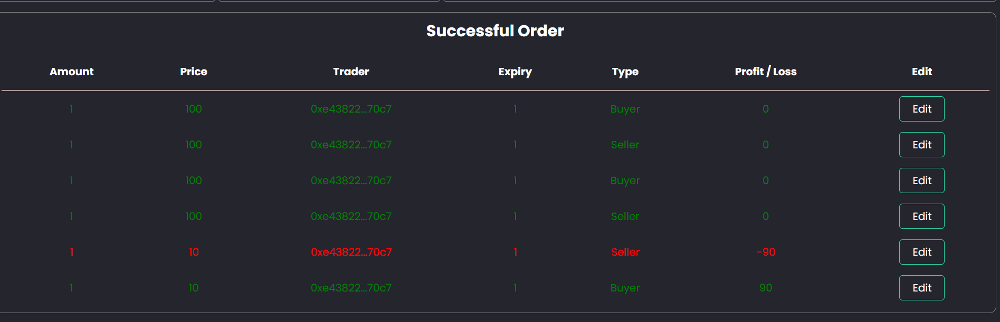
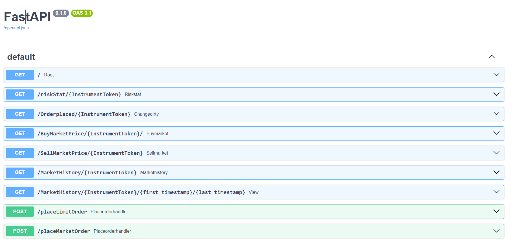

#### Link For Demo of the Platform 
https://drive.google.com/file/d/1yPkJHUe1RUzIBdrHkONERE9QeYbnUJCZ/view?usp=sharing


# Zero-Day Future Contracts

This project aims to develop and deploy a decentralized futures trading platform on the Aptos blockchain. This platform focuses on offering seamless trading of short-term futures contracts expiring within 24 hours, with the potential to include longer-dated contracts in the future.


## Steps for running locally

First clone the repo to your local machine

```git clone 'repos url'```


### Frontend

#### Installing dependencies

Go to the project directory

```bash
  cd futurefrontend
```

Install dependencies

```bash
  npm i
```
Start the server

```bash
  npm run start
```
The frontend will be hosted locally at https://localhost:3000/ by default.


### Backend

#### Starting the Server

enter your private key here 
module name 


```env
APTOS_NODE_URL="https://fullnode.devnet.aptoslabs.com/v1"
ACC_PRIV_KEY="0xf603ba08e7ca86fcf30297bb4c4fbc2fc2599f890052f73b16dfbe7e"
MOD_NAME="Coin1"
EXP_ORD_FUNC="expiryOrderBookNotMatch"
MARKET_PRICE_FUNC="MarketPriceList"
PLACE_ORDER_FUNC="place_Order"
```

Create `.env` file like above and then run the below code to start server.

```bash
pip3 install -r requirement.txt
python3 main.py
```

Your server will start on `localhost:8000` by default.


## Contract  
Setup Aptos CLI
Prerequisites
First, ensure you have Python 3.6+ installed:
```
$ python3 --version
Python 3.9.13
```
#### macOS / Linux / Windows Subsystem for Linux (WSL)


using `wget`

```
wget -qO- "https://aptos.dev/scripts/install_cli.py" | python3
```

using `curl`
```
curl -fsSL "https://aptos.dev/scripts/install_cli.py" | python3
```

#### Windows(NT)
```
iwr "https://aptos.dev/scripts/install_cli.py" -useb | Select-Object -ExpandProperty Content | python3
```
Setup your enviroment following the steps https://aptos.dev/tutorials/build-e2e-dapp/create-a-smart-contract

Compile the code
```
aptos move compile
```
Run test cases
```
aptos move test
```
Publish the contract
```
aptos move publish
```
### Requirements
The contract is deployed on Aptos Explorer's DEVNET, hence one need `Petra Wallet`,
Aptos's wallet connected to DEVNET and having some APT (extracted from faucet) for proceeding with transactions.

Address where required modules are published : 

Installation Guide - https://petra.app/

## Inspiration
### What are zero day futures on web3?

This proposal endeavors to pioneer the development of a cutting-edge decentralized futures trading platform, seeking to rectify the inherent shortcomings of prevailing Web2 paradigms. Web2 platforms are notorious for their `susceptibility to security breaches and the centralized authority` they vest with single points of control, enabling potential market manipulations.


The envisioned platform, rooted in Web3 principles, aspires to surmount these challenges. Tailored to prioritize short-term futures contracts with a 24-hour expiration window, the platform holds the potential to integrate more extended contract durations in subsequent phases.


Diverging from the conventional monthly cycles, this innovative platform introduces zero-day futures, characterized by their `rapid expiration`. Notably, users retain the autonomy to extend the expiration period, augmenting the adaptability and sophistication of their trading strategies. This paradigm shift not only bolsters security measures but also champions a `democratized approach` to futures trading, liberating users from the constraints of centralized control and fostering a `more equitable and transparent financial ecosystem`.

## What we have done / Our solution 
We present to you our future finance app that solves all the issues of Web2 and utilizes Aptos abilities to its maximum. 
Future wallet offers zero day futures for various tokens. Our solution uses Aptos quick transactions and computation power of move language.
Without the need of a backend acting as a storage unit our solution eliminates the need for the main server. The computation and storage is carries out the contract itself, thus removes problems such as server downtime .


## Architectural Design


## Features and functionalities
The user first needs to connect his wallet making sure he is connected to the DEVNET and has some APT from the faucet.


### Real time OrderBook 
- The order book of a specific token displays the Order placed throughout the platform, it displays both buy and sell orders. It updates at an interval of 3 sec, It involves no third party and directly interacts with the contract.

[](https://postimg.cc/9wWtF1Fn) 


- Rather than conventional ways of using loops and iterating through the entire orderbook, we have implemented heaps that efficiently match prices in `log(n)` T.C.
- Market orders are instantaneously matched while limit orders wait for their price to be matched.
- This allows the conventional web2 users & analysts to analyze and study the market depth.
- The order book clears at `EOD` according to `IST` and the non matched orders are returned to the users.


### Placing orders


A user can place `2`  kinds of buy and sell orders namely `Limit and Market Orders`. It works exactly as a conventional future platform. Orders are directly added to the blockchain, thus having secure transactions.   
#### 1) Trade Token:
 The user has to select the token in which they want to trade. Currently, we offer `5 different tokens` currently with the ability to add more before final deploying. The tokens are independent of each other and run parallely in different contracts, making them 
#### 2) Order Type: 
The user selects their type of order whether `buy or sell`.
#### 3) Types of Order
- Limit Orders:
    - 
    - Unlike traditional sites that offer in lot sizes the user can specify any quantity and there is no minimum for it.
    - Predicting market trends the user selects the price for their limit order.
    - With the help of a slider the user selects the `Leverage`  which is offered in a multiple of 5.
    - It also displays the `liquidation price` which is capped at `90%` and prevents defaults, the orders liquidate which fail to meet this criteria. 


- Market Orders:
    -
    - Again the user specifies the amount which they want to buy/sell
    - The price is set to the market price of the orders, that is for buyers the lowest of sellers and for sellers the highest of buyers.
    - These orders are instantaneously matched, If the quantity at highest price finishes the price moves on to the next orders till the quantity is not satisfied.


After clicking confirm the Petra wallet prompts to pay the amount and gas fees.


Transactions can be placed using three ways -
- From `Frontend` (for normal users)
- From `Aptos Explorer` for testing purpose, one can navigate to the module address and see the core functioning.
- From `Python SDK` for market simulation and stress testing. We have also provided a script for tests. 


[](https://postimg.cc/Z9jVvCCR)
### Successful orders
#### 1) Matching of orders
Our matching algorithm utilizes `FIFO (First In First Out)` algorithm for order matching, if the prices match the orders are matched according to their timestamps.
#### 2) Updating Order book
The orders which are matched are automatically removed from the order book and pushed to the success book.
#### 3) Viewing of orders 
The orders of the user themselves are displayed in the successful transaction section. One can view their order details and also see `real time profit or loss according to current market price` on their order book.
#### 4) End of Day
At the end of the day the profit and loss is transferred to the user from the `Resource Account`, there is no generation of money in the market, ones profit is the loss of another.
#### 5) Automated liquidation
The orders who suffer loss more than the income are automatically liquidated at any point of the day.The liquidation is set to 90% and prevent the risk of defaults.


### N-day expiry
One of the key features that differentiates Zero day orders from rest of the futures platforms is it ability to extend its day of expiry, one can edit the 





After the orders are matched the user can opt to edit the expiry of contract, at the end of each day the orders price would be calculated using the profit and loss of the user at EOD and again placed with same quantity , this process is repeated till the time the contract does not expire while also checking for liquidation throughout the day.


### Viewing Current Market Price and Market Price
The platform provides the facility to view the current market price going on in the market and see a detailed candlestick chart of it.


The market price of the buy and sell orders going on for each individual token and providing a live graph of it.


### Graphs
All the data of the graph is sourced from `fastAPI calls` that provide the required data, as the data is sourced directly from the blockchain this is guaranteed to be free of manipulation. To prevent overloading of requests of data from contract the data is fetched using API calls that are evenly spaced. The data is `stored locally on the browser cache`. 


#### Current Market Price
The candlestick chart pattern provides the accurate real time current time market price to determine possible price movement based on past patterns. Candlesticks are useful when trading as they show four price points (open, close, high, and low) throughout the period the trader specifies. These can be used to develop strategies for algo trading.
#### Market price 
The Market price of each of the token is displayed depending to the token selected and a line chart for it displayed. It lets the buyers and seller on the platform be more aware of prices and form stratergies accordingly.

### Resource Account 
The platform utilizes the feature of resource account to store and trafer APT, since storing in account of the deployer would raise security concerns a non mutable contract hosted on the resource account allows seamlesss transactions and makes sure that their is no need to approve the transactions by the deployer.

At the expiry, the profit and loss is transfered to the users,  this call happens from the backend, to prevent overcalls of contract at EOD we have set a time window from 23:55 to 00:00 during this time a call can be made, once a user makes a call ( automatically happens when a order is placed during this time span) another call does not take place until the next EOD, for futher details checkout `changeJ` fucntion in the contract. 

### API
Requirements
```
fastapi
aptos-sdk
"uvicorn[standard]"
apscheduler
numpy
python-dotenv
```

## Automated Risk Mitigation
### Machine Learning Approach 
Our model uses the `Time Series Analyses` and implements a `Exponential 3 degree model` : ` Holts Winter` to `forecast` the upcoming trends. We provide the model current market prices,  the model checks for three patterns mainly
- Seasonal
- Periodic 
- Trend
After analyzing the data it provide one of the four outcomes 
```
"volatile but bullish"
"volatile but bearish"
"safe and bearish"
"safe and bullish"
```
We display these results on the frontend to help users to study the current position of the market. This is result is refreshed at an interval of every 3 sec.

### Contract details and features

The contract is published on ` address of contract    ` , it can be view on the aptos explorer.
to run the file locally setup the aptos CLI as stated above.

The contract imports the standard libraries, we have provided some error prompts to improve testiabality of the code.

#### Structs :- 
- Order : Explains the structure of orders.
- BuyOrder and SellOrder :  Contains a Vector of Orders placed by users on that particular day.  
- TotalSuccessOrder :  Contains a Vector of  the Matched Orders.
- BuyMap and SellMap : Stores all the Buy and Sell Prices.
- BuyHeap : Maintains a sorted list of buy prices, with the highest price at the top.
- SellHeap : Maintains a sorted list of sell prices, with the lowest price at the top.
- MarketPriceList : Maintains a record of current market prices .
- ModuleData : Stores the sign of the resource Account.

#### View Functions :-
- getBuyList : Returns the list of `BuyOrders` on that particular day and n-day orders which haven't yet expired
- getSellList : Returns the list of `SellOrders` on that particular day and n-day orders which haven't yet expired
- getTotalSuccessList: Returns the list of orders successfully placed on a particular day
- getCurrentMarketPrice: Returns the current Market Price

#### Entry Functions :- 
- place_Order : Used to place order, arguments given to it are quantity, price, side (either buy or sell), leverage (can be upto 25x)
- market_place_Order : Used to place order on the market price
- editSuccessOrders : Used to roll over expiry of a successful contract to n-days

#### Helper functions :-
- matchOrder : Used for matching algorithm using FIFO algorithm, heap data structure is used for keeping list of buyOrders and sellOrders
- expiryOrderBookNotMatched : Called after every placeOrder to check whether the contract has expired to ensure 24-hour expiry
- liquidationLoop : Checks whether prices exceeds its liquidation price i.e. it incurs loss more than its initial investment. We have capped it at 90% to reduce defaults


We have added functionality of zero days as well as K days of expiry, morever within this expiry user can extend/rollover to N days.

### Backend

A fastAPI backend is used for implement the market and transaction APIs. The APIs are based on PythonSDK provided by Aptos. 



### What might be implemented in the future

To store historical market data, we can emit events whenever an order is placed. We can track all the events emitted using Aptos Lab hosted Indexer GraphQL API and store the data on a PostgreSQL server. This time series data can be used to make better predictions and can be exposed to people interested in algorithmic trading. 


